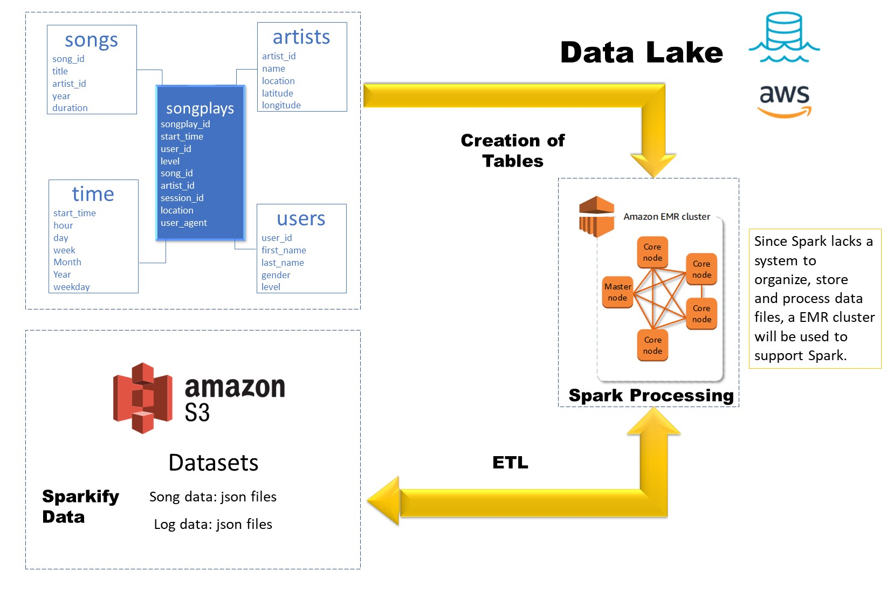

# Project: Data Lake

## Introduction

A music streaming startup, Sparkify, has grown their user base and song database even more and want to move their data warehouse to a data lake. Their data resides in S3, in a directory of JSON logs on user activity on the app, as well as a directory with JSON metadata on the songs in their app.

## Description 

You will need to perform an ETL process to load data from S3, process the data into analytics tables using Spark, and load them back into S3. You'll deploy this Spark process on a cluster using AWS.

## Datasets

* Song data: s3://udacity-dend/song_data

Files that contain information like:
<pre>
<code>
"{"num_songs": 1, "artist_id": "ARJIE2Y1187B994AB7", "artist_latitude": null, "artist_longitude": null, "artist_location": "", "artist_name": "Line Renaud", "song_id": "SOUPIRU12A6D4FA1E1", "title": "Der Kleine Dompfaff", "duration": 152.92036, "year": 0}"
</code>
</pre>

* Log data: s3://udacity-dend/log_data

## Templates

* etl.py ► reads data from S3, processes that data using Spark, and writes them back to S3
* dl.cfg ► contains your AWS credentials
* README.md ► provides discussion on your process and decisions
 

 ## How to run
 
 (Install AWS CLI)

 1.- Create an SSH key pair.
 EC2 menu.

 2.- Search for EMR service and create a cluster.
 EMR (Elastic Map Reduce) EC2 instancec with many big data technologies.

 3.- Create an S3 Bucket named <code>sparkify-dend</code>.

 4.- Fill the requiered credentials and data in the document dl.cfg. 
<code>
KEY=YOUR_AWS_ACCESS_KEY
SECRET=YOUR_AWS_SECRET_KEY
</code>

 5.- On a console run etl.py
<code>
python etl.py
</code>

 6.- Once finished the process quit the AWS EMR cluster.

 # Thanks!