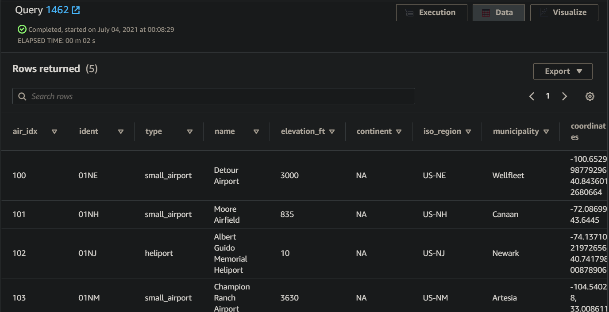
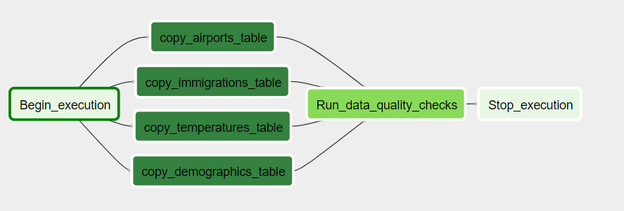

# Data engineering capstone project

## Data sources.

* <a href= "https://public.opendatasoft.com/explore/dataset/us-cities-demographics/export/">US-cities-demographics.csv</a> / Demograpjic data for cities

<pre>Columns ► city | state | media_age | male_population | female_population | total_population | num_veterans | foreign_born | average_household_size | state_code | race | count</pre>

* <a href= "https://www.trade.gov/national-travel-and-tourism-office">immigration_data_sample.csv</a> / l94 imigration data

<pre>Columns ► cicid | year | month | cit | res | iata | arrdate | mode | addr | depdate | bir | visa | coun | dtadfil | visapost | occup | entdepa | entdepd | entdepu | matflag | biryear | dtaddto | gender | insnum | airline | admnum | fltno | visatype</pre>

* <a href= "https://datahub.io/core/airport-codes#data">airport-codes_csv.csv</a> / information related to airports

<pre>Columns ► ident | type | name | elevation_ft | continent | iso_country | iso_region | municipality | gps_code | iata_code | local_code | coordinates</pre>

* <a href= "https://www.kaggle.com/berkeleyearth/climate-change-earth-surface-temperature-data">GlobalLandTemperaturesByCity.csv</a> / Kaggle source (This study combines 1.6 billion temperature reports from 16 pre-existing archives)

<pre>Columns ► dt | AverageTemperature | AverageTemperatureUncertainity | City | Country | Latitude | Longitude</pre>

## Directory overview

* capstone_project_notebook.ipynb

* sql_queries.py

* README.py

## Data exploration.

This stage is to use PySpark and look for the data frame informations, such as nulls, data frame dimentions, and types of data.

After taking a look a the data frames it comes the desition to keep usefull columns and get rid of useless columns

## Data selection and cleaning.

For the 4 files only the columns with data that I considered useless were removed and also columns with the most of the null or missing values, the whole process is on the <pre>capstone_project_notebook.ipynb</pre> using PySpark to manipulate dataframes, then the data were saved as CSV files and uploaded to and AWS S3 bucket.

## Database creation to redshift.

After the DB creation with the command <pre>python create_tables.py</pre>

The DB is populated with the files from S3 (using the COPY command) / 
<pre>python etl.py</pre>

## Query in the Redshift DB.

### Schema.

An overview of the complete process

## Consuming data (some analitics queries).

## Issues solved

Due to: 

* Some data types missmatch between the CSV files and the DB.

* A difference in the number of columns in the tables and CSV files.

It was needed to use the query "" to take a look at the errors.

## Complete Project Write Up

* What's the goal?

Integrate the knowledge gained trough the lessons to create this project.

* What queries will you want to run? / Why did you choose the model you chose?

For the DB we could get different info type about US immigrations / airports / demographics / temperatures and that info could be joined by location (state, country ...) except the airports data wich lat and long info should be transformed into state or city before performing joins by place but that step takes too much time so I've skipped it.

* How would Spark or Airflow be incorporated?

Actually spark is used to work with the data frames because is faster than pandas.

Working with airflow the DAg would be something like this...

* Clearly state the rationale for the choice of tools and technologies for the project.

PySpark
AWS_S3
AWS_Redshift

* Propose how often the data should be updated and why.

Depending on the ammount of data that is recorded in one day or the data latency requiered by the company, but for this type of data the records could be updated daily or weekly in order to keep the ñas updates in the ammount of immigranst or demographics data.

* Post your write-up and final data model in a GitHub repo.

<a href= "https://github.com/juan-ivan-NV/Data_Engineering_Nanodegree/tree/main/16_Project_5_Capstone_Project">Github project</a> 

* Include a description of how you would approach the problem differently under the following scenarios:

    * If the data was increased by 100x.
    
    For that reason the data is stored in Redshift warehouse, so the data can keep wrowing and also the cluster capacity.

    * If the pipelines were run on a daily basis by 7am.

    For that reason Airflow implementation could be a good choice to set the data pipeline execution hourly or daily. 
    
    * If the database needed to be accessed by 100+ people.

    While storing the DB in Redshift or another warehouse we can grant those access and set the cluster for that ammount of requests.

