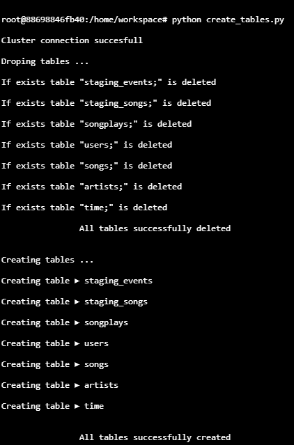
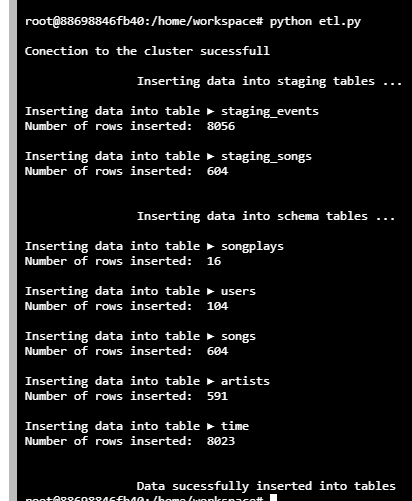

# Data Warehouse

A music streaming startup, Sparkify, has grown their user base and song database and want to move their processes and data onto the cloud because their analytics team wants to continue finding insights in what songs their users are listening to.

### Project Diagram:

The task is to build an ETL pipeline that extracts their data from S3, stages them in Redshift, and transforms data into a set of dimensional tables for their analytics team to continue finding insights in what songs their users are listening to.


### Files from S3 Sparkify

Song data ► Is a subset of real data from the Million Song Dataset. Each file is in JSON format and contains metadata about a song and the artist of that song. The files are partitioned by the first three letters of each song's track ID

Log data ► Consists of log files in JSON format generated by this event simulator based on the songs in the dataset above. These simulate app activity logs from an imaginary music streaming app based on configuration settings.

Both datasets are used to load the information in the Staging Tables.

#### Staging Tables

* staging_events
* staging_songs

Then the staging tables are used to load the data to the schema tables.

## Project Files

* dwh.cfg ► Contains the AWS credentials and directions.

``` 
[CLUSTER]
HOST= 'cluster_name.xxxxxxxxx.region.redshift.amazonaws.com'
DB_NAME= 'db_name'
DB_USER= 'aws_user'
DB_PASSWORD= 'xxxxxxx'
DB_PORT= '5439'

[IAM_ROLE]
ARN=arn:aws:iam::xxxxxxxxxxx:role/Redshift_Role_Name

[S3]
LOG_DATA='s3://xxxxxxxxxx/log_data'
LOG_JSONPATH='s3://xxxxxxxx/log_json_path.json'
SONG_DATA='s3://xxxxxxxxx/song_data'
```

* sql_queries.py ► It defines the SQL statements, which will be imported into the two other files above to create, delete and load data into the tables.
* create_table.py ► It executes the queries to create fact and dimension tables for the star schema in Redshift.
* etl.py ► It executes the queries to load data from S3 into staging tables on Redshift and then process that data into the analytics tables on Redshift.

## How to run the scripts

After creating the AWS Role with the <mark>permission needed (very important)</mark> and the AWS Redshift cluster 

1.- To create all the tables 

> python create_table.py 



2.- To load the data into the tables from the Redshift schema

> python etl.py 




