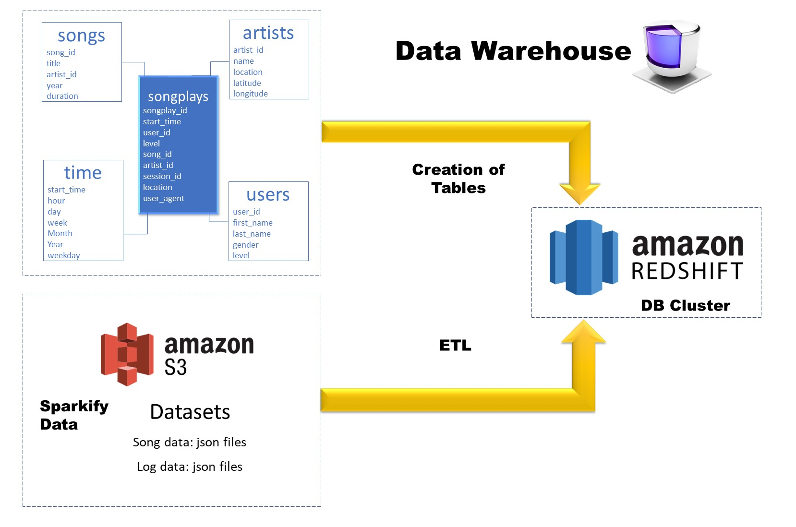

# Data Engineering Nanodegree

## Basic study plan

### 1 Welcome to the Nanodegree Program

### 2 Data Modeling

Learn to create relational and NoSQL data models to fit the diverse needs of data consumers. Use ETL to build databases in PostgreSQL and Apache Cassandra.

* Project: Data Modeling with Postgres
* Project: Data Modeling with Apache Cassandra

### 3 Cloud Data Warehouses

* Project: Data Warehouse

Project to create an AWS Redshift DB and load data from AWS S3 through an ETL process.

### 4 Data Lakes with Spark

This module is focused on Spark with python, for syntax, take data from a DB and also connect to AWS.

* Project: Data Lake

### 5 Data Pipelines with Airflow

* Project: Data Pipelines

### 6 Capstone Project

* Project: Data Engineering Capstone Project