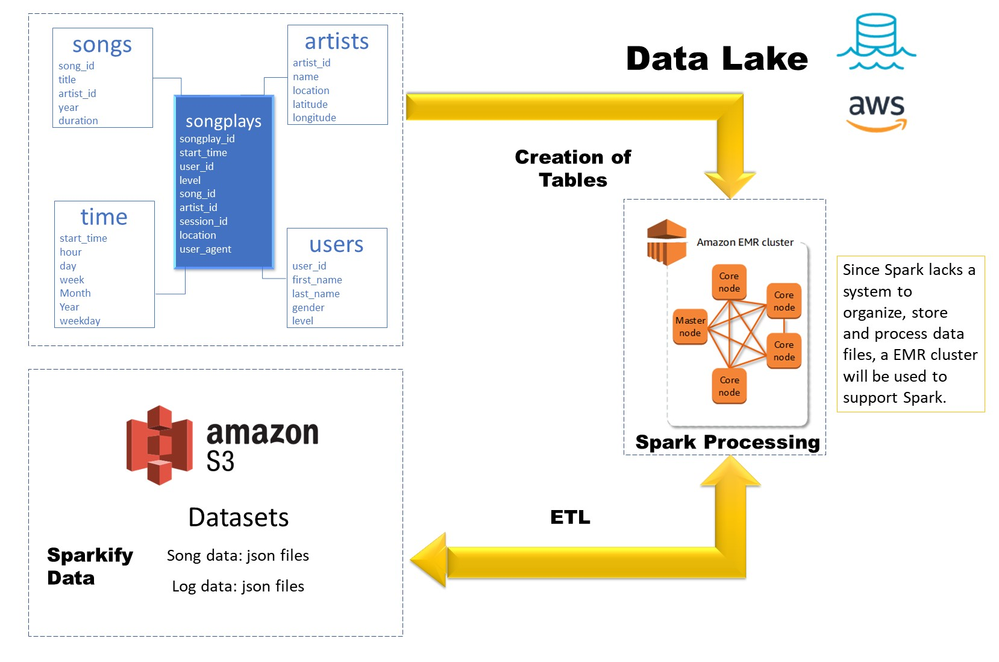

# Data Engineering Nanodegree

## Basic study plan

### 1 Welcome to the Nanodegree Program

### 2 Data Modeling

Learn to create relational and NoSQL data models to fit the diverse needs of data consumers. Use ETL to build databases in PostgreSQL and Apache Cassandra.

* Project: Data Modeling with Postgres
* Project: Data Modeling with Apache Cassandra

### 3 Cloud Data Warehouses

* Project: Data Warehouse

Project to create an AWS Redshift DB and load data from AWS S3 through an ETL process.

### 4 Data Lakes with Spark

This module is focused on Spark with python, for syntax, take data from a DB and also connect to AWS.

Data lakes: Unstructured or semi-structured data, different types, from different sources (ELT).

Data wharehouse: A structured DB (ETL).

* Project: Data Lake

### 5 Data Pipelines with Airflow

* Project: Data Pipelines

A music streaming company, Sparkify, has decided that it is time to introduce more automation and monitoring to their data warehouse ETL pipelines and come to the conclusion that the best tool to achieve this is Apache Airflow.

For this project involves high grade data pipelines that are dynamic and built from reusable tasks, can be monitored, and allow easy backfills. Also as data quality is added for analyses and tests against the datasets after the ETL steps have been executed to catch any discrepancies in the datasets.

The source data resides in S3 and is processed in Sparkify's data warehouse in Amazon Redshift. The source datasets consist of JSON logs that tell about user activity in the application and JSON metadata about the songs the users listen to.

### 6 Capstone Project

* Project: Data Engineering Capstone Project

# Graduated!!!

<a href= "https://confirm.udacity.com/YGNADWQH">Certificate</a>

